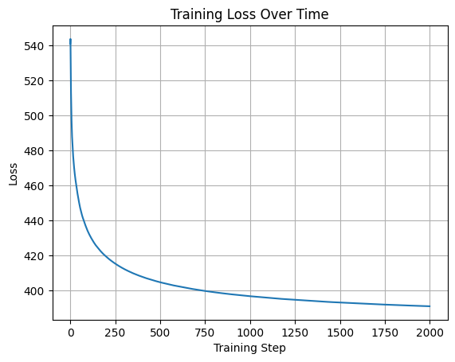
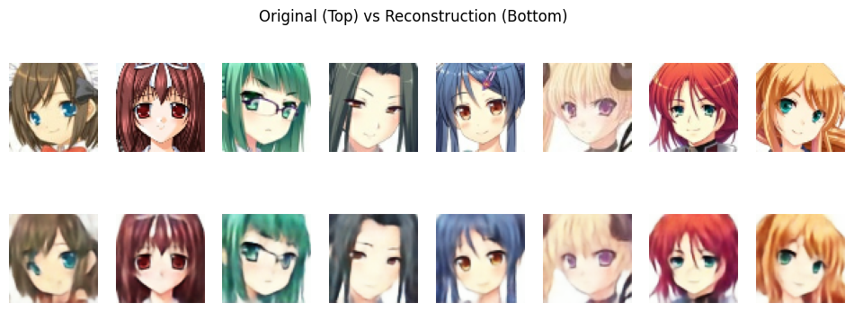

# 🎨 Anime Face Generation using Variational Autoencoders (VAE)

This project implements a **Variational Autoencoder (VAE)** trained on an anime face dataset. It demonstrates the core principles of probabilistic generative modeling using deep neural networks, with a focus on stable training and visual outputs.

---

## ✨ Key Features

- ✅ Implemented custom Encoder, Decoder, and Sampling (reparameterization trick)
- ✅ Stable KL Divergence computation with log-variance
- ✅ Binary Crossentropy-based reconstruction loss
- ✅ Visual monitoring with image grids saved every 100 steps
- ✅ Training loss curve visualization
- ✅ GIF generation from outputs to show progress

---

## 📊 Results

- Reconstruction quality improves over time
- Latent space shows smooth interpolation between generated faces
- KL loss regularization encourages meaningful compression

---

## 📈 Training Curve

We track and visualize loss metrics over time to ensure stable learning and convergence.

<p align="center">
  <p align="center">
    
    <br>
    <i>Training Loss Curve</i>
  </p>
</p>

---

## 🔄 Input vs Reconstruction

The VAE not only generates new samples but also attempts to **reconstruct input images** after encoding them into the latent space and decoding back.

This allows us to evaluate how well the model has learned to capture meaningful information from the input.

<p align="center">
  
  <br>
  <i>Top: Original Images | Bottom: Reconstructed Outputs</i>
</p>

The visual similarity between inputs and reconstructions demonstrates the encoder-decoder pipeline's effectiveness.
"""

## 🛠️ Getting Started

### 1. Clone this repo

```bash
git clone https://github.com/Ryhan9834/VAE-Anime-faces.git
cd VAE-Anime-faces
```

### 2. Install dependencies

```bash
pip install -r requirements.txt
```

### 3. Run the notebook

Use Jupyter or VS Code to run:

```
VAE_AnimeFace.ipynb
```

---

## 🌀 Generate Training GIF

```python
from utils import create_gif
create_gif(image_folder='generated_images', output_gif='vae_training_progress.gif', fps=5)
```

<p align="center">
  
  <br>
  <i>Sample Output - VAE traning progress</i>
</p>

---

## 📁 Files

| File                                | Description                            |
|-------------------------------------|----------------------------------------|
| `VAE_AnimeFace.ipynb` | Full VAE implementation and training loop |
| `requirements.txt`                 | Required Python packages               |
| `anime.keras`                      | Trained model|
| `assets/`                           | store images, gif for README and documentation|
| `README.md`                        | This file|

---

## 📚 References

- [Kingma & Welling, 2013 - Auto-Encoding Variational Bayes](https://arxiv.org/abs/1312.6114)
- [Anime Face Dataset](https://github.com/bchao1/Anime-Face-Dataset)

---

## 🧠 Author

#### This project is developed by [Md. Ryhan Uddin](https://github.com/Ryhan9834)                
---

## ⭐ Show your support

If you found this helpful, give it a ⭐ on GitHub!